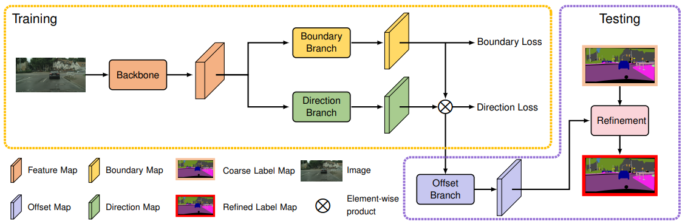

# openseg.pytorch


[](https://paperswithcode.com/sota/semantic-segmentation-on-coco-stuff-test?p=object-contextual-representations-for)

[](https://paperswithcode.com/sota/semantic-segmentation-on-pascal-context?p=object-contextual-representations-for)

[](https://paperswithcode.com/sota/semantic-segmentation-on-ade20k-val?p=object-contextual-representations-for)

	
[](https://paperswithcode.com/sota/semantic-segmentation-on-lip-val?p=object-contextual-representations-for)

[](https://paperswithcode.com/sota/semantic-segmentation-on-cityscapes?p=object-contextual-representations-for)

## News

- 2020/07/09
[OCR (Spotlight)](https://arxiv.org/pdf/1909.11065.pdf) and [SegFix](https://arxiv.org/pdf/2007.04269.pdf) have been accepted by the ECCV-2020. Notably, the reseachers from Nvidia set a new state-of-the-art performance on Cityscapes leaderboard: [85.4%](https://www.cityscapes-dataset.com/method-details/?submissionID=7836) via combining our HRNet + OCR with a new [hierarchical mult-scale attention scheme](https://arxiv.org/abs/2005.10821). 

- 2020/05/11
We have released the checkpoints/logs of "HRNet + OCR" on all the 5 benchmarks including Cityscapes, ADE20K, LIP, PASCAL-Context and COCO-Stuff in the [Model Zoo](https://github.com/openseg-group/openseg.pytorch/blob/master/MODEL_ZOO.md). Please feel free to try our method on your own dataset.

- 2020/04/18
We have released the checkpoint/log of ISA.

- 2020/04/16
We have released some of our checkpoints/logs of OCNet, OCR and SegFix. **We highly recommend you to use our SegFix to improve your segmentation results as it is super easy & fast to use.**

- 2020/03/12
Our SegFix could be used to improve the performance of various SOTA methods on both semantic segmentation and instance segmentation, e.g., "PolyTransform + SegFix" achieves **Rank#2** on Cityscapes leaderboard (instance segmentation track) with performance as 41.2%.

- 2020/01/13
The source code for reproduced [HRNet+OCR](https://github.com/HRNet/HRNet-Semantic-Segmentation/tree/HRNet-OCR) has been made public.

- 2020/01/09
"HRNet + OCR + SegFix" achieves **Rank#1** on Cityscapes leaderboard with mIoU as **84.5%**. 

- 2020/01/07
"HRNet+OCR[Mapillary+Coarse]" currently achieves **84.26%** on Cityscapes test with better Mapillary pretraining, where we pretrain the HRNet+OCR model on the original Mapillary training set and achieve **50.8%** on Mapillary val set. We can expect higher performance with various improvements, e.g., ASP-OCR, larger batch size/crop size (as in Panoptic-DeepLab) and our novel post-processing mechanism.

- 2020/01/03
"HRNet+OCR" will be made open-source in the code-base [HRNet-Semantic-Segmentation](https://github.com/HRNet/HRNet-Semantic-Segmentation) very soon, thanks for your patience.

- 2020/01/02
Please email us (yuyua@microsoft.com) if you need the code for our OCR module and we would like to share it with you ASAP. We also hope you could try our method in your own code base and share the results with us.

- 2019/11/19
We have updated the paper [OCR](https://arxiv.org/abs/1909.11065).
Our approach achieves **83.7%** and we can further achieve **84.0%** on Cityscapes test set with a novel yet simple model-agnostic post-processing scheme. Our model-agnostic post-processing scheme is a new work under progress, which can be applied to improve the results of any existing approaches without any re-training or fine-tuning.

- 2019/09/25
We have released the paper [OCR](https://arxiv.org/abs/1909.11065), which is method of our **Rank#2** entry to the leaderboard of Cityscapes.

- 2019/07/31
We have released the paper [ISA](https://arxiv.org/abs/1907.12273), which is very easy to use and implement while being much more efficient than OCNet or DANet based on conventional self-attention.

- 2019/07/23
We (HRNet + OCR w/ ASP) achieve **Rank#1** on the leaderboard of Cityscapes (with a single model) on 3 of 4 metrics.

- 2019/06/19
We achieve **83.3%+** on the leaderboard of Cityscapes test set based on single model [HRNetV2](https://github.com/HRNet/HRNet-Semantic-Segmentation) + OCR. [Cityscapes leaderboard](https://www.cityscapes-dataset.com/benchmarks/#pixel-level-results)
We achieve **56.02%** on the leaderboard of ADE20K test set based on single model ResNet101 + OCR without any bells or whistles. [ADE20K leaderboard](http://sceneparsing.csail.mit.edu/eval/leaderboard.php)

- 2019/05/27
We achieve SOTA on **6** different semantic segmentation benchmarks including: **Cityscapes, ADE20K,  LIP, Pascal-Context, Pascal-VOC, COCO-Stuff**. We provide the source code for our approach on all the six benchmarks.


## Model Zoo and Baselines

We provide a set of baseline results and trained models available for download in the [Model Zoo](MODEL_ZOO.md).

## Introduction

This is the official code of [OCR](https://arxiv.org/abs/1904.04514.pdf), [OCNet](https://arxiv.org/abs/1809.00916.pdf), [ISA](https://arxiv.org/abs/1907.12273.pdf) and [SegFix](https://arxiv.org/pdf/2007.04269.pdf). OCR, OCNet, and ISA focus on better context aggregation mechanisms (in the semantic segmentation task) and ISA focuses on addressing the boundary errors (in both semantic segmentation and instance segmentation tasks). We highlight the overall framework of OCR and SegFix in the figures as shown below:

<figure>
  <text-align: center;>
  
  <figcaption>Fig.1 - Illustrating the pipeline of OCR. (i) form the soft object regions in the
  pink dashed box. (ii) estimate the object region representations in the purple dashed box.
  (iii) compute the object contextual representations and the augmented representations
  in the orange dashed box.
</figcaption>
</figure>

<figure>
  <text-align: center;>
  
  <figcaption>Fig.2 - Illustrating the SegFix framework: In the training stage, we first send
  the input image into a backbone to predict a feature map. Then we apply a boundary
  branch to predict a binary boundary map and a direction branch to predict a direction
  map and mask it with the binary boundary map. We apply boundary loss and direction
  loss on the predicted boundary map and direction map separately. In the testing stage,
  we first convert the direction map to offset map and then refine the segmentation
  results of any existing methods according to the offset map.
  </figcaption>
</figure>


## Citation
Please consider citing our work if you find it helps you,
```
@article{yuan2018ocnet,
  title={Ocnet: Object context network for scene parsing},
  author={Yuan, Yuhui and Wang, Jingdong},
  journal={arXiv preprint arXiv:1809.00916},
  year={2018}
}

@article{huang2019isa,
  title={Interlaced Sparse Self-Attention for Semantic Segmentation},
  author={Huang, Lang and Yuan, Yuhui and Guo, Jianyuan and Zhang, Chao and Chen, Xilin and Wang, Jingdong},
  journal={arXiv preprint arXiv:1907.12273},
  year={2019}
}

@article{yuan2020ocr,
  title={Object-Contextual Representations for Semantic Segmentation},
  author={Yuan, Yuhui and Chen, Xilin and Wang, Jingdong},
  journal={ECCV},
  year={2020}
}

@article{yuan2020segfix,
  title={SegFix: Model-Agnostic Boundary Refinement for Segmentation},
  author={Yuan, Yuhui and Xie, Jingyi and Chen, Xilin and Wang, Jingdong},
  journal={ECCV},
  year={2020}
}
```

## Acknowledgment
This project is developed based on the [segbox.pytorch](https://github.com/donnyyou/segbox.pytorch) and the author of segbox.pytorch donnyyou retains all the copyright of the reproduced Deeplabv3, PSPNet related code. 
